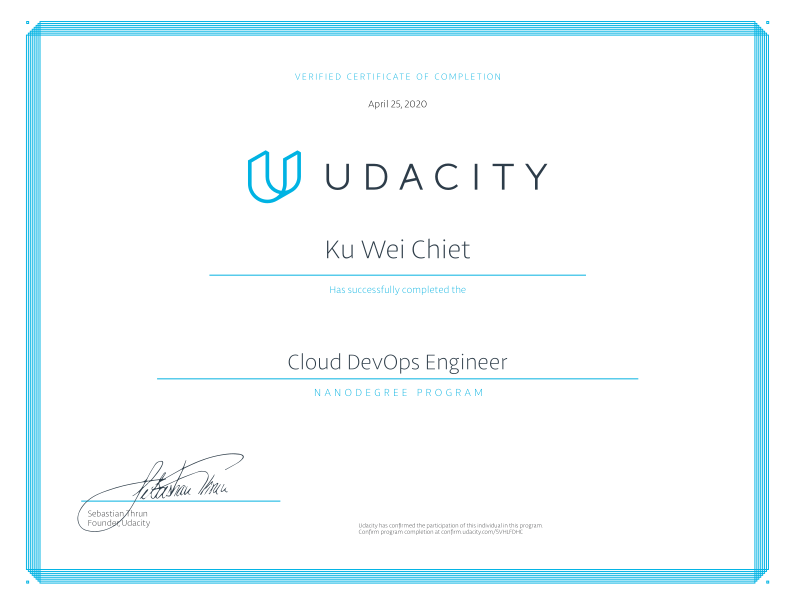

# Cloud DevOps Engineer Nanodegree  

## Program Description  
The Cloud DevOps Engineer Nanodegree program is geared towards operations and software engineering professionals who want to build infrastructure that delivers product and services at both speed and scale. The [program](https://www.udacity.com/course/cloud-dev-ops-nanodegree--nd9991) includes projects that teach you how to create continuous integration and continuous delivery (CI/CD) pipelines, deploy massive infrastructure securely using code, and operationalize microservices using Kubernetes. These projects will prepare you to become a successful DevOps engineer.  

[Graduation Certificate](https://confirm.udacity.com/5VHLFDHC)

## Course Syllabus
### 1. **Cloud Fundamentals**  
Leverage a pre-trained model for computer vision inferencing. You will convert pre-trained models into the framework agnostic intermediate representation with the Model Optimizer, and perform efficient inference on deep learning models through the hardware-agnostic Inference Engine. Finally, you will deploy an app on the edge, including sending information through MQTT, and analyze model performance and use cases.

  **Project 1: [Deploy Static Website on AWS](./project_1)**
  * The cloud is perfect for hosting static websites that only include HTML, CSS, and JavaScript files that require no server-side processing. In this project, you will deploy a static website to AWS. First, you will create an S3 bucket, configure the bucket for website hosting, and secure it using IAM policies. Next, you will upload the website files to your bucket and speed up content delivery using AWS’s content distribution network service, CloudFront. Lastly, you will access your website in a browser using the unique S3 endpoint.

### 2. **Deploy Infrastructure as Code (IAC)**
With the advent of cloud computing, along came several tools that enabled us to deploy the underlying infrastructure components that provide security and services to our servers by writing scripts. In this course, you’ll learn how to deploy this infrastructure using CloudFormation, AWS’ tool for Infrastructure as Code.   

  You will use CloudFormation to deploy Infrastructure patterns that are used broadly in the industry and can be readily used to deploy any cloud application. Like in the real world, you will begin with initial business requirements that you will turn into Cloud Architecture Diagrams. Then, you will deploy this architecture using CloudFormation.  

**Project 2: [Deploy a High-Availability Web App Using CloudFormation](./project_2)**  
* In this project, you’ll deploy web servers for a highly available web app using CloudFormation. You will write the code that creates and deploys the infrastructure and application for an Instagram-like app from the ground up. You will begin with deploying the networking components followed by servers, security roles and software. The procedure you follow here will become part of your portfolio of cloud projects. You’ll do it exactly as it’s done on the job: following best practices and scripting as much as possible.  

### 3. **Build CI/CD Pipelines, Monitoring & Logging**  
In this course, you’ll learn the process of taking software from source code to deployment and beyond. You’ll learn about automated testing, choosing the right deployment strategy for your business needs and deploying an appropriate CI/CD pipeline. You’ll also learn about monitoring and logging to ensure that your application is running at peak performance and stays that way.  

  You’ll also learn to manage and make changes to your servers in an automated way, using Ansible, a leading Configuration Management tool.

**Project 3: [Build CI/CD Pipelines, Monitoring & Logging](./project_3)**  
  * In this project, you’ll demonstrate your Cloud DevOps engineer skills as a new employee at UdaPeople, an innovative new Human Resources company that depends on quick release cycles and a rock solid, high-quality product. You will help the development team deliver value continuously by building an automated CI/CD pipeline. Those new skills will also be put to the test as you set up automated monitoring and alerting to ensure the delivered value stays valuable. Thanks to your new skills and hard work, UdaPeople will have a massive competitive advantage in the PeopleOps marketplace and will surely go on to change the world!  

### 4. **Microservices at Scale Using Kubernetes**  
In this course, you will learn to create and deploy a Kubernetes cluster, configure Kubernetes autoscale, and load test a Kubernetes application. You’ll learn to operationalize both existing and new microservices, and apply containers best practices. You’ll learn to deploy Machine Learning microservices that are elastic and fault tolerant. You’ll learn to pick the appropriate abstraction for microservices: Serverless (AWS Lambda) or Container Orchestration (Kubernetes).  

  **Project 4: [Operationalize a Machine Learning Microservice API](./project_4)**  
  * In this project, you will continue your work on operationalizing microservices by deploying an elastic and fault-tolerant Machine Learning inference API using Kubernetes. You’ll configure this microservice to be highly available by using Kubernetes best practices. You will validate your design by load testing the service and verifying the application architecture performs as designed.  

**Project 5: [Capstone Project](./project_5)**  
  * The purpose of the Cloud DevOps Engineer capstone project is to give you a chance to combine what you've learned throughout the program. This project will be an important part of your portfolio that will help you achieve your cloud development-related career goals. In the capstone project, each project is unique to the student. You’ll build a CI/CD pipeline for a microservices application for different deployment strategies. Students define the scope of the project and select the right deployment strategy based on different business requirements.
