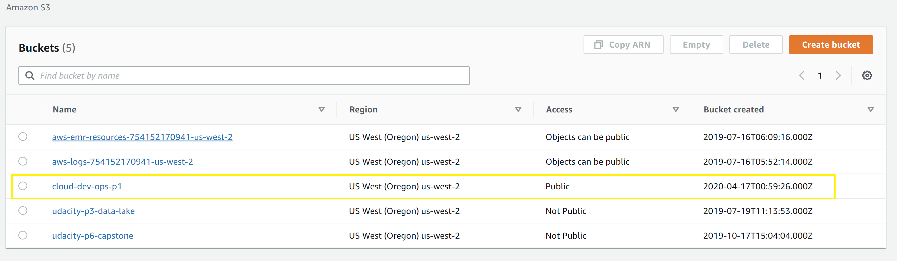
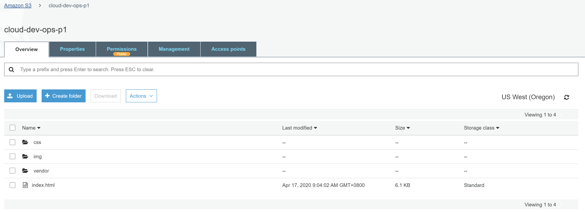
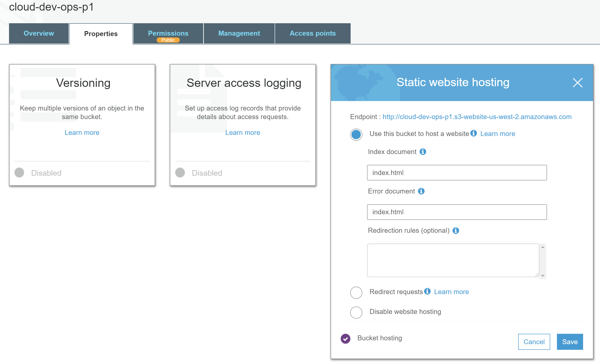
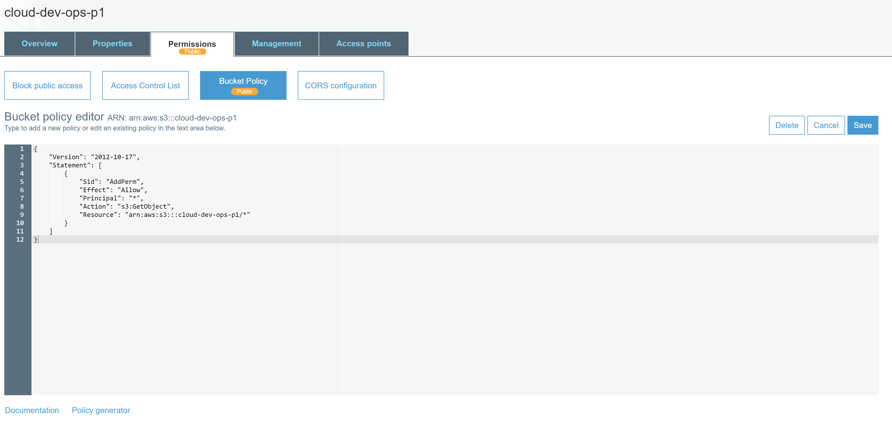
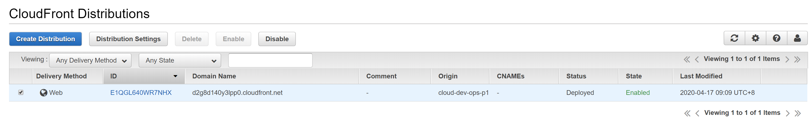

# Deploy Static Website on AWS  

The cloud is perfect for hosting static websites that only include HTML, CSS, and JavaScript files that require no server-side processing. In this project, you will deploy a static website to AWS. First, you will create a S3 bucket and upload the website files to your bucket. Next, you will configure the bucket for website hosting and secure it using IAM policies. Next, you will speed up content delivery using AWS’ content distribution network service, CloudFront. Lastly, you will access your website in a browser using the unique CloudFront endpoint.

**Prerequisites:**
* AWS Account  
* Student-ready starter code: https://drive.google.com/open?id=15vQ7-utH7wBJzdAX3eDmO9ls35J5_sEQ  

**Topics Covered**
* S3 bucket creation  
* S3 bucket configuration  
* Website distribution via CloudFront  
* Access website via web browser  

**Dependencies**
Cloud Services
* Amazon Web Services S3 - Resource hosting and deployments
* AWS CloudFront - CDN for SPA
* AWS EKS - Backend API
* AWS DynamoDB - Persistent Datastore
* AWS Cognito - User Authentication

Performance Tracking and DevOps Tools:
* AWS CloudWatch - Performance and Health checks
* Sentry - Bug Reporting
  * Alternates:
  * TBD
* Google Analytics - Usage Reporting
  * Alternates:
  * Mixpanel
* Travis (CI/CD)

Frameworks:
* Ionic (Javascript) (Frontend)
* Node.js (Javascript) (Backend)  

## Steps
1. Create an S3 Bucket, configure the bucket for website hosting, and secure it using IAM policies.  
2. Upload the website files to the bucket and speed up content delivery using AWS’s content distribution network service, CloudFront.  
3. Access the website in a browser using the unique S3 endpoint.  

## Screeshoot

The following are the screenshot of the results of each steps to deploy a static website on AWS:

The student has created a S3 bucket.

All website files should be added to the S3 bucket.

The bucket configuration should be set up to support static website hosting.

The permission access to the bucket should be configured to allow public access.

The website should be distributed via Cloudfront.

Is the website publicly accessible?

 The URL of the website: http://cloud-dev-ops-p1.s3-us-west-2.amazonaws.com/index.html
