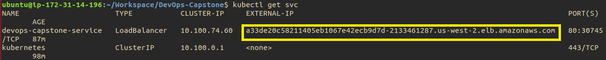
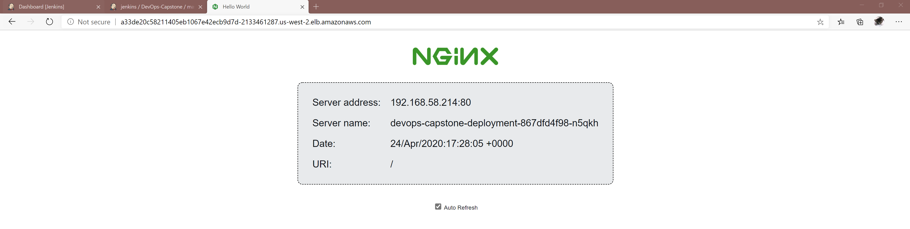

# Udacity Cloud DevOps Nanodegree Capstone Project

The objective of this project is to apply the skills and knowledge which were developed throughout the Cloud DevOps Nanodegree program. These include:
* Working in AWS
* Using Jenkins to implement Continuous Integration and Continuous Deployment
* Building pipelines
* Working with Ansible and CloudFormation to deploy clusters
* Building Kubernetes clusters
* Building Docker containers in pipelines

The directions of the project can be found [here](./Project_Directions.md).  

The application that I've chosen is [nginx-hello](https://github.com/nginxinc/NGINX-Demos/tree/master/nginx-hello), which is a NGINX webserver that serves a simple page containing its hostname, IP address and port as wells as the request URI and the local time of the webserver.

## Environment Setup

1. Create an Ubuntu EC2 instance on AWS and SSH to the instance.
2. Setup [Jenkins](https://linuxize.com/post/how-to-install-jenkins-on-ubuntu-18-04/) and install plugins.
3. Setup AWS and Docker Hub credentials in Jenkins.
4. Install [Docker](https://docs.docker.com/engine/install/ubuntu/) and:  
  4.1 Create the `docker` group.  
    ` sudo groupadd docker`  
  4.2 Add user `jenkins` to the docker group.  
      `sudo usermod -aG docker jenkins`
5. Install [Kubernetes](https://kubernetes.io/docs/tasks/tools/install-kubectl/)
6. Install [AWS CLI](https://docs.aws.amazon.com/cli/latest/userguide/install-cliv2-linux.html), [aws-iam-authenticator](https://docs.aws.amazon.com/eks/latest/userguide/install-aws-iam-authenticator.html) and [eksctl](https://eksctl.io/introduction/installation/) and:  
  6.1 Copy `aws-iam-authenticator` to `/bin` folder so that it can be accessed by Jenkins.  
      `sudo cp /home/ubuntu/bin/aws-iam-authenticator /bin/aws-iam-authenticator`
7. Install [tidy](https://www.html-tidy.org) and [hadolint](https://github.com/hadolint/hadolint).

## Create Kubernetes Cluster
1. Execute `./create_cluster.sh` in `k8s_cluster folder`
2. Copy the Kubernetes configuration  to `/var/lib/jenkins`  
`sudo cp ~/.kube/config /var/lib/jenkins/.kube/config`  
`sudo chown -R jenkins /var/lib/jenkins/.kube/config`

## CI/CD Pipeline (Rolling Deployments)
1. Create a new pipeline in Jenkins.
2. Jenkins will lint the HTML and Dockerfile.
3. Upon successful linting, Jenkins will build a docker image and push the image to Docker Hub.
4. This will then followed by a [rolling update deployment](https://kubernetes.io/docs/concepts/workloads/controllers/deployment/) on Kubernetes cluster.
5. Execute `kubectl get svc` command in the terminal to obtain the load balancer external IP address.  

6. Access the webserver application via `http://IP_Address:80` on web browser.

7. Jenkins pipeline stages (Steps-2 to Steps-4) will be executed automatically for any changes in the code or application and the latest container image will be deployed.

## Files
* `/k8s_cluster` folder: Scripts to create Kubernetes cluster on AWS.
* `/nginx-hello` folder: Webserver application
* `Dockerfile`: Dockerfile to create the docker image of the application.
* `Jenkinsfile`: Jenkinsfile to create the CI/CD pipeline.
* `screenshots`: Folder containing screenshots images of this project.
